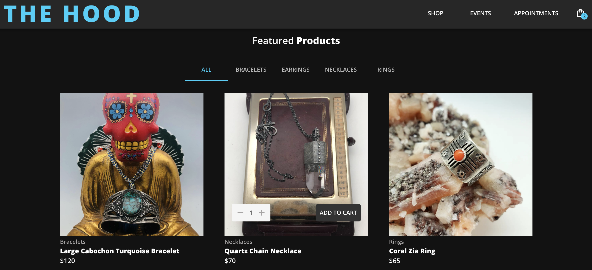
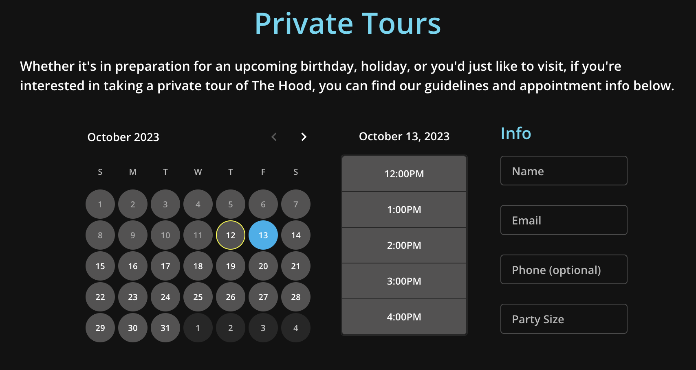
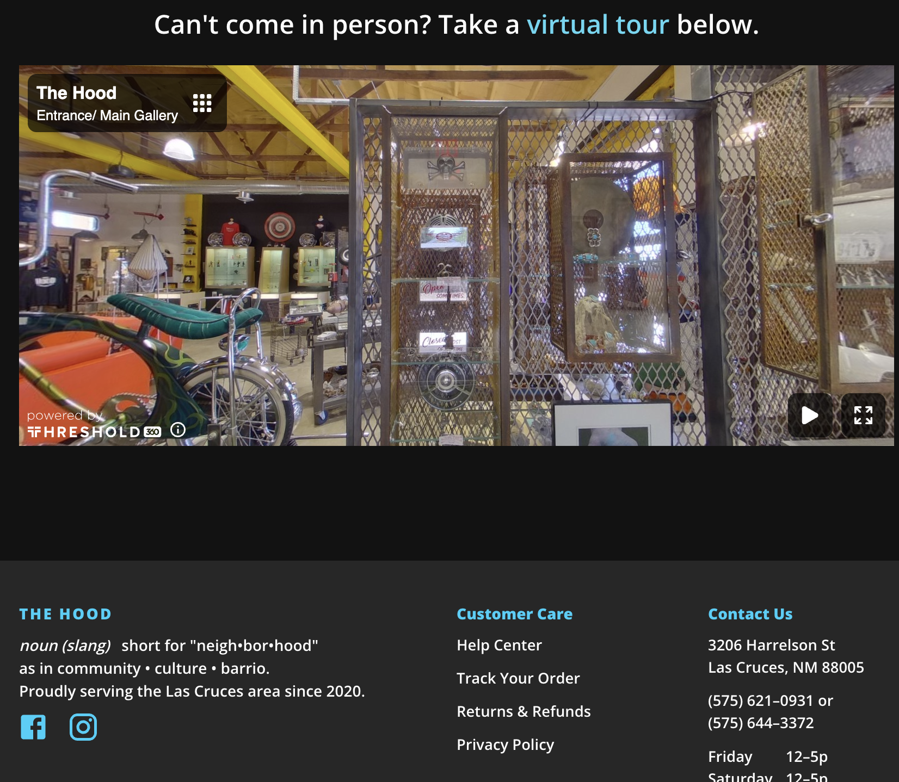

# The Hood eCommerce Website

Digital storefront for Las Cruces, NM based business specializing in art, jewelry, and events

[Live Site](https://tylersernett.github.io/react-ecommerce/)



## Installation & Usage

Installation
```js
npm install
```

Client:
```js
npm run build
npm run start
```

Server:
```js
npm run develop
```

## Built With
React ⬩ Redux ⬩ Material UI ⬩ Strapi ⬩ Stripe ⬩ Formik ⬩ Yup

## Features
Material UI styling, stateful Redux shopping cart, Strapi CMS backend, Formik/Yup form validation, Stripe checkout, appointment scheduler, Threshold 360 virtual tour

## Appintment Scheduler Preview:



## Tour Preview:

